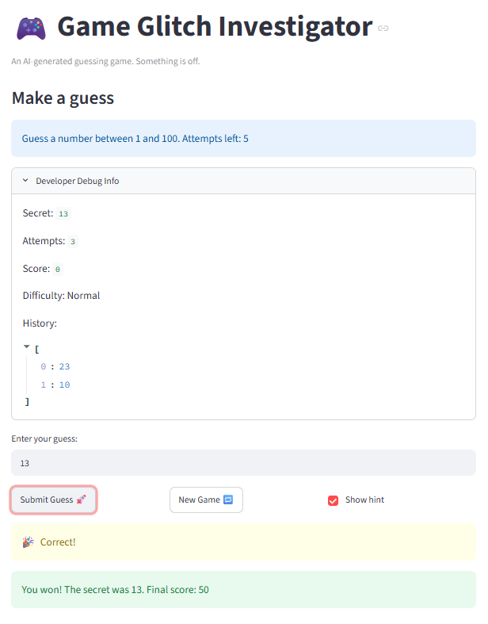
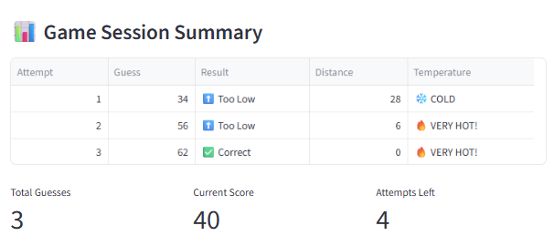

# 🎮 Game Glitch Investigator: The Impossible Guesser

## 🚨 The Situation

You asked an AI to build a simple "Number Guessing Game" using Streamlit.
It wrote the code, ran away, and now the game is unplayable. 

- You can't win.
- The hints lie to you.
- The secret number seems to have commitment issues.

## 🛠️ Setup

1. Install dependencies: `pip install -r requirements.txt`
2. Run the broken app: `python -m streamlit run app.py`

## 🕵️‍♂️ Your Mission

1. **Play the game.** Open the "Developer Debug Info" tab in the app to see the secret number. Try to win.
2. **Find the State Bug.** Why does the secret number change every time you click "Submit"? Ask ChatGPT: *"How do I keep a variable from resetting in Streamlit when I click a button?"*
3. **Fix the Logic.** The hints ("Higher/Lower") are wrong. Fix them.
4. **Refactor & Test.** - Move the logic into `logic_utils.py`.
   - Run `pytest` in your terminal.
   - Keep fixing until all tests pass!

## 📝 Document Your Experience

- [ ] Describe the game's purpose.
- [ ] Detail which bugs you found.
- [ ] Explain what fixes you applied.
 Game Glitch Investigator is a number guessing game where your objective is to 
 guess the secret number in a limited number of attempts. There are optional hints 
 to tell you if your guess was higher or lower than the actual number and a restart
 button to play the game again. There are three diffculties: Easy, Normal, and Hard to try out. 

I found several bugs, including not checking if the number was out of range, the variables not resetting when the "New Game" button is clicked, and the hints not properly showing up. Now, the current code will check if the number is within range.
It will not consider it an attempt if it is out of range. The variables are reset 
when the "New Game" button is clicked, so the session is properly reset. Finally, 
the hints show up at the right time and aren't delayed by one now. 
## 📸 Demo Walkthrough

Describe your fixed game in numbered steps so a reader can follow along without watching a video:

Assumes that the secret number is 63
1. User enters a guess of 34 -> Game returns "Too Low"
2. User enters a guess of 89 -> Game returns "Too High"
3. Score will decrease by 5 if the guess is wrong
4. The game will after if the user enters the secret number or runs out of attempts
5. The "New Game" can be clicked to restart the game 

**Screenshot** *(optional)*: 


## 🧪 Test Results

```
# Paste your pytest output here, e.g.:
# pytest tests/
# ========================= X passed in 0.XXs =========================
```


## 🚀 Stretch Features

- [ ] [If you choose to complete Challenge 4, describe the Enhanced UI changes here — a screenshot is optional]
After making a guess, it also displays different temperatures. If the guess is within 10%, it is hot. If it's within 25%, it is warm. Otherwise, it is cold. When there are no attempts left or the player guessed the correct number, it shows a game summary
with stats like current score, total guesses, result, and distance from the secret number.
